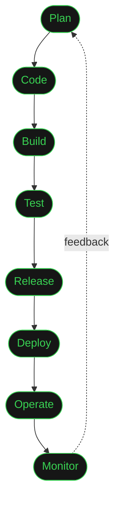

<div align="center">

# DAMI

### CLOUD PLATFORMS · AUTOMATION · DEVELOPER EXPERIENCE

I build the paved roads that let engineering teams move quickly without making
reliability, security, or operability somebody else’s problem.

<a href="https://github.com/dhamsey3">GitHub</a> · <a href="https://github.com/dhamsey3?tab=repositories">Projects</a>

<br>


</div>

<br>

```text
01  PLATFORM ENGINEERING     self-service infrastructure that scales with the team
02  CLOUD AUTOMATION          repeatable delivery, clean interfaces, fewer handoffs
03  OPERABILITY               systems that are observable before they are on fire
```

## A little context

I’m a cloud-native engineer working at the intersection of infrastructure,
software delivery, and developer enablement. My favorite work turns a fragile
manual process into a dependable system with a useful interface.

I care about:

- Infrastructure that is reproducible, secure, and easy to evolve
- Delivery systems that make the right path the easiest path
- Platform APIs and tooling that give developers useful autonomy
- Observability and incident response built into the design

## Tools I reach for

**Cloud & Infrastructure**
<p>
  
  
  
  
  
  
</p>

**CI/CD & Source Control**
<p>
  
  
  
  
</p>

**Languages**
<p>
  
</p>

**Observability & Incident Response**
<p>
  
  
  
</p>

## The loop I actually work in



## Selected builds

- **[pg-slot-sentinel](https://github.com/dhamsey3/pg-slot-sentinel)** — Monitors Postgres replication slots for orphaned WAL retention before it fills RDS storage. Ships with a docker-compose demo that reproduces the failure mode end to end.
- **[PipelineForge](https://github.com/dhamsey3/pipelineforge-aws-devops-platform)** — An AWS-native delivery platform with CodePipeline, CodeBuild, ECR, and ECS Fargate.
- **[Distributed Load Testing](https://github.com/dhamsey3/distributed-load-testing)** — Distributed performance testing for understanding how systems behave under load.
- **[Internal Developer Platform API](https://github.com/dhamsey3/internal-developer-platform-api)** — A repeatable API for provisioning infrastructure and supporting Kubernetes deployments.
- **[OpenStreetMap on AWS](https://github.com/dhamsey3/openstreetmap-aws-cloud-deployment)** — Terraform, ECS/Fargate, RDS, and CI/CD assembled as a production-style deployment.
- **[ELK SIEM Sandbox](https://github.com/dhamsey3/siem-sandbox-elk)** — A Docker lab for log analysis, detection engineering, and security experiments.
- **[Automation with Python](https://github.com/dhamsey3/Automation-with-Python)** — Small operational tools that remove repetitive work and sharpen daily workflows.

## The pipeline that eats its own output

Regenerated nightly by a scheduled GitHub Action that walks my contribution
graph — the same automation habit, pointed at a README instead of a
production system.

<div align="center">

<picture>
  <source media="(prefers-color-scheme: dark)" srcset="https://raw.githubusercontent.com/dhamsey3/dhamsey3/output/github-contribution-grid-snake-dark.svg" />
  
</picture>

</div>

## Current direction

```text
cloud infrastructure  /  internal platforms  /  delivery automation
security-minded ops    /  useful abstractions  /  fewer manual rituals
```

<div align="center">

<sub>Build systems people can trust. Keep learning in public.</sub>

</div>
